# osm-pt-routebuilder

Herramienta para construir y actualizar relaciones de transporte público en OpenStreetMap (OSM) utilizando trazas GPS y el servicio Valhalla.

Este proyecto contiene dos scripts en Jython diseñados para ejecutarse dentro del entorno de JOSM (Java OpenStreetMap Editor), facilitando la creación o modificación de relaciones de tipo `route=bus` a partir de datos de trazas.

---

## 🔧 Configuración en JOSM

Para que los scripts funcionen correctamente, es necesario realizar algunos pasos previos en JOSM.

### 1. Activar los plugins necesarios
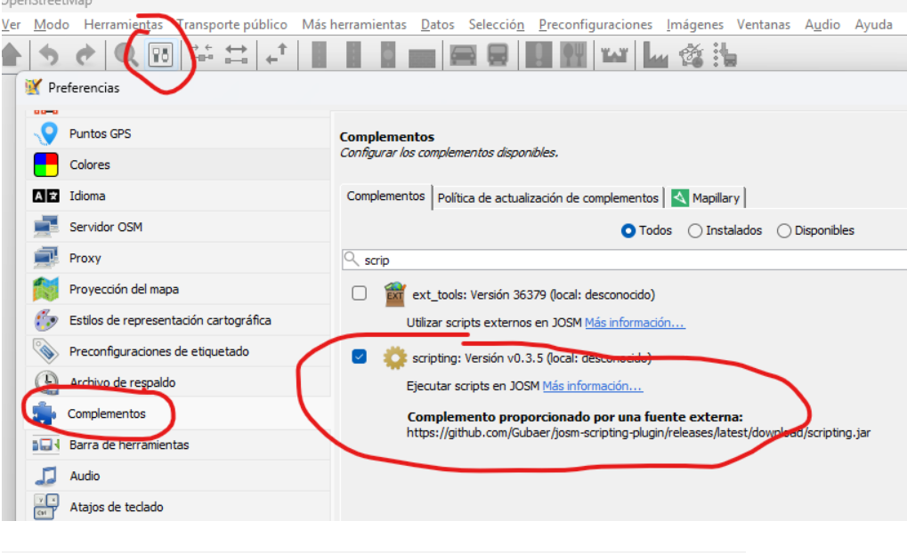

### 2. Configurar el entorno de scripting
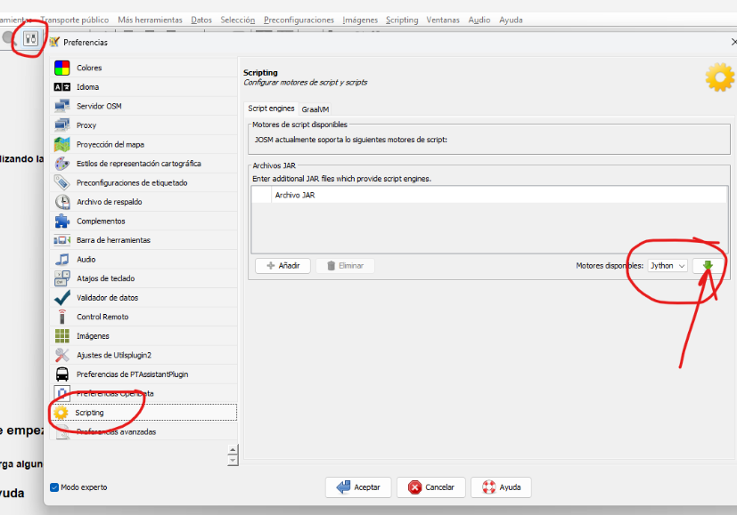

### 3. Versión compatible del plugin de scripting
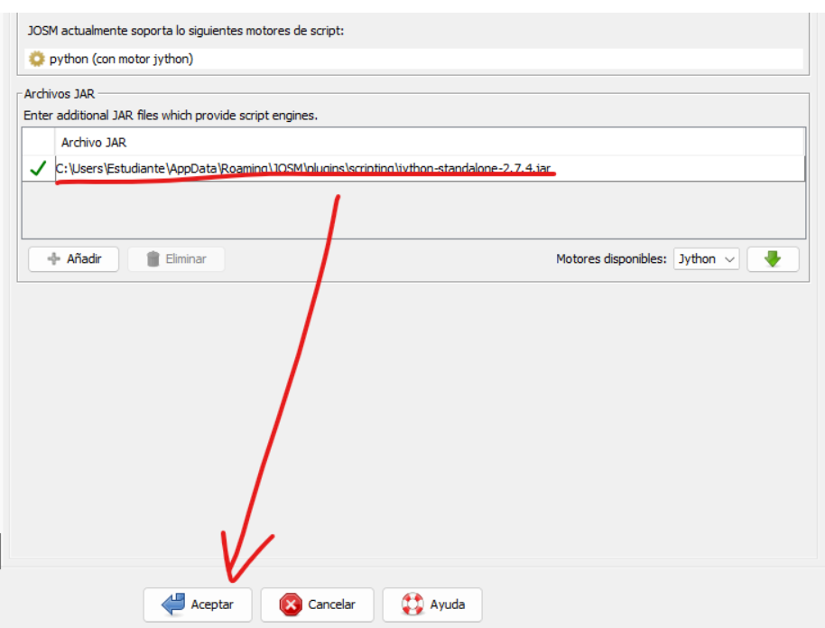

### 4. Abrir los archivos `.py` desde el motor de scripting
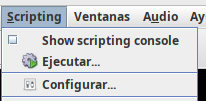  
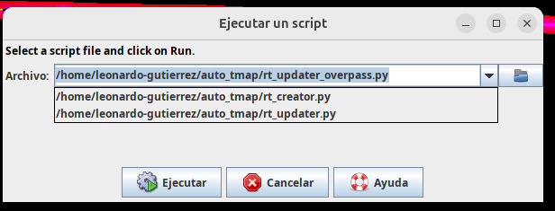

### 5. Seleccionar el motor Jython
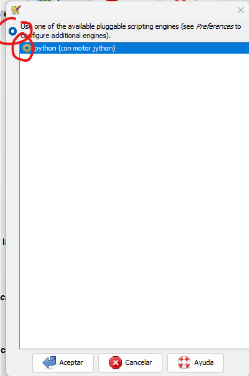

---

## 📂 Archivos incluidos

### `rt_creator.py`
- Genera una nueva relación OSM de tipo `route=bus` usando `way_id` obtenidos desde Valhalla.
- Exporta la relación a un archivo `.osm`.
- Genera una capa GPX a partir de las vías seleccionadas.

### `rt_updater.py`
- Tiene dos modos:
  - **Modo 1**: convierte una traza en `way_id` y los guarda en memoria.
  - **Modo 2**: aplica esos `way_id` a una relación seleccionada, reemplazando sus miembros.

---

## 🧩 Requisitos

- [JOSM](https://josm.openstreetmap.de/)
- Plugin de scripting habilitado
- Motor Jython configurado
- Conexión a internet (para Valhalla y OSM API)

---

## 🚀 Uso

A continuación se describen dos flujos de trabajo separados:

---

## 🧭 Crear una nueva relación

Este flujo está diseñado para construir una nueva relación de tipo `route=bus` desde cero, utilizando una traza GPS.

### 1. Cargar el archivo fuente en una capa independiente
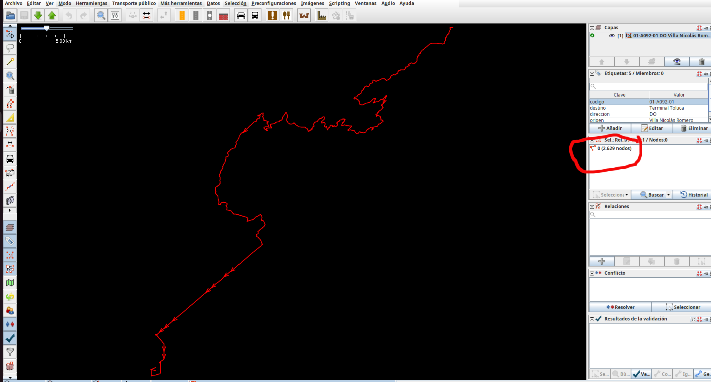

### 2. Ejecutar el script `rt_creator.py`
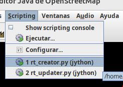

### 3. Conversión automática a GPX
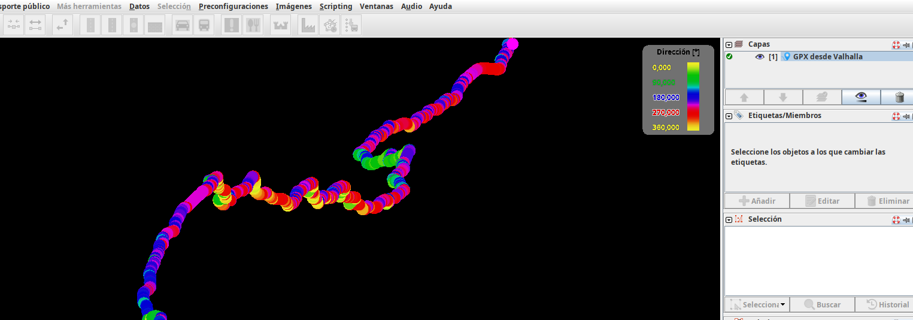

### 4. Abrir el archivo `rel.osm` generado

### 5. Ver la relación sin miembros descargados
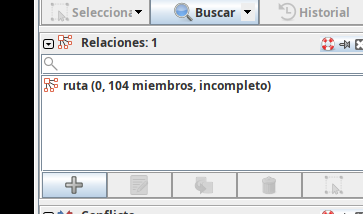

### 6. Descargar miembros de la relación
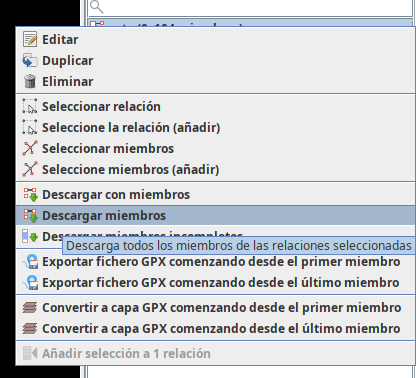

---

## 🔁 Actualizar una relación existente

Este flujo permite actualizar los miembros de una relación existente usando una traza nueva.

### 1. Cargar el archivo fuente como en la creación

### 2. Cargar la relación existente
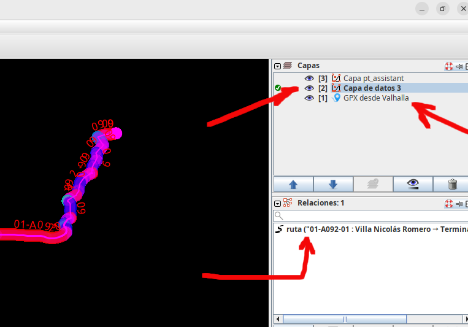

### 3. Ejecutar el script `rt_updater.py` con la traza seleccionada
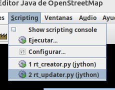

### 4. Seleccionar la relación existente
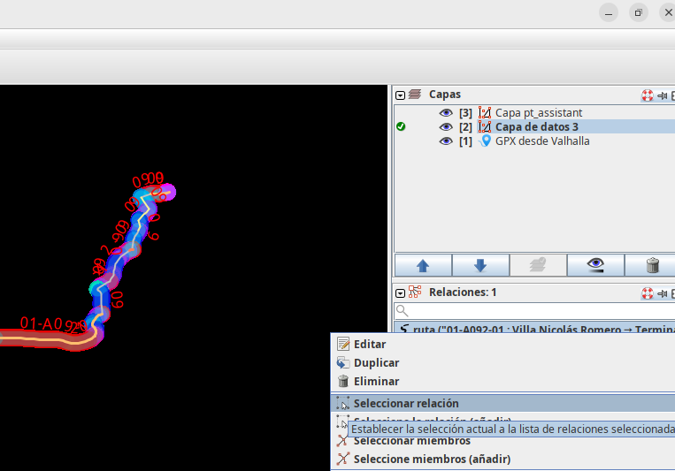

### 5. Ejecutar nuevamente el script con la relación seleccionada


> ⏳ Este paso puede tardar de 15 a 60 segundos.

### 6. Validar la relación actualizada

> ⚠️ Asegúrese de que la nueva relación no tenga interrupciones ni errores antes de subirla a OSM.

---

## 🗂️ Estructura del proyecto

```plaintext
osm-pt-routebuilder/
├── rt_creator.py
├── rt_updater.py
├── images/
│   ├── imagen1.png
│   ├── imagen2.png
│   ├── imagen3.png
│   ├── imagen4.png
│   ├── imagen5.png
│   ├── imagen6.png
│   ├── imagen7.png
│   ├── imagen8.png
│   ├── imagen9.png
│   ├── imagen10.png
│   ├── imagen11.png
│   ├── imagen12.png
│   ├── imagen13.png
│   └── imagen14.png
└── README.md
